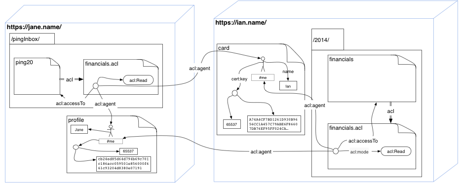

## Private Sharing

Originally put forward by Ben Roberts ([permalink](https://www.w3.org/wiki/Socialwg/Social_API/User_stories#Private_Sharing)):

> 1. Ian wants to share a file with Jane
> 2. Ian posts the file file to his site with it set to only show to Jane.
> 3. Jane receives a notice that Ian has shared a file with her.
> 4. Jane views the file and decides to leave a thank you comment on the file for Ian

{>> Point 1 is just a desire. We cut point 2. into two parts: the first is uploading a file, and the second is limiting access. <<}
{>> Replaced Jan with Jane, so that during aural communication the two
names don't end up getting constantly confused <<}

### Background

This story has a privacy aspect so we will use [WebID+TLS authentication](http://www.w3.org/2005/Incubator/webid/spec/tls/) to illustrate it. Other authentication methods should also work with [Web Access Control](http://www.w3.org/2005/Incubator/webid/spec/), such as WebID which is easy, and others that need to be looked at.


Ian has WebID <https://ian.name/card#me> with a public key.

```
GET /card HTTP/1.1
Host: ian.name:443
Accept: text/turtle, application/ld+json
```
```
HTTP/1.1 200 Ok
Accept-Patch: application/sparql-update
Access-Control-Allow-Origin: *
Allow: OPTIONS, GET, HEAD, SEARCH, PATCH
Content-Type: text/turtle
ETag: "1417390950000|Success(922)"
Last-Modified: Sun, 1 April 2015 23:42:30 GMT
Content-Type: text/turtle
Content-Length: 545
Link: <.acl>; rel=acl
Link: <http://www.w3.org/ns/ldp#Resource>; rel="type"

@prefix foaf: <http://xmlns.com/foaf/0.1/> .
@prefix cert: <http://www.w3.org/ns/auth/cert#> .
@prefix xsd: <http://www.w3.org/2001/XMLSchema#> .

<card> a foaf:PersonalProfileDocument;
   foaf:primaryTopic <card#me> .
   
<card#me> a foaf:Person ;
     foaf:name "Ian;
     foaf:knows <https://jane.org/profile#me> ;
     cert:key [ a cert:RSAPublicKey;
                rdfs:label "my laptop certificate key";
                cert:exponent 65537 ;
                cert:modulus "A74A4CF7BD1261D930B9656CC1A457C79ABE6F86607DB76EF95FF024CA6B712DD03DDB178669562170D7CAA8431528E1139AE85D1E72B09BD552CAD0FA94225CACA9363D799A10C0269A7DD70E28AFE0971B8352048F5DFC55537480F334155CBA98434678A887457D6378D19C8C0E9F59CA99E21492308CE4510B68C12BA3002862E30839E7D91EE0F9BF1155E07854D99FE12A32B4FB03862466203BF0E5C0D3B90B5AB6B5CABA520811FD02097CE5680C1D8B55098C566C11066B37FE43A26FCD1AA93E7A9919446F39B0E3C0D6C1C9BEB509E86255101634CBE738C52553ACC14A7FE50D536BBA5F8D96BFE0B5DA33095466B61B4141CE91405838072477"^^xsd:hexBinary;
             ] .
```

In order to be able to do command line curl demos, we will assume that
Ian has saved his certificate an private key in the `cert.pem` file locally. (Of course it is not needed to do this in browsers...)

The certificate public key is the one in the profile.

```bash
$ openssl x509 -in IanCert.pem -inform pem -text
Certificate:
    Data:
        Version: 3 (0x2)
        Serial Number:
            01:49:f1:d4:3d:e6
        Signature Algorithm: sha1WithRSAEncryption
        Issuer: CN=WebID, O={}
        Validity
            Not Before: Nov 27 15:07:38 2014 GMT
            Not After : Nov 24 15:17:38 2024 GMT
        Subject: dnQualifier=tester@localhost.edu
        Subject Public Key Info:
            Public Key Algorithm: rsaEncryption
            RSA Public Key: (2048 bit)
                Modulus (2048 bit):
                    00:b7:cb:16:af:0a:ee:c5:8a:4c:0c:05:e0:50:4a:
                    33:43:82:a1:db:7a:8a:09:20:57:f9:7c:27:14:39:
                    f7:ff:8c:fd:46:9b:61:59:34:fa:40:1b:4b:32:0b:
                    75:6c:f0:17:e1:6c:8e:e0:d5:af:ce:ed:1a:54:39:
                    07:38:72:0c:67:81:3b:76:5e:1b:f9:e3:10:80:9e:
                    13:3b:7f:7c:2a:ca:34:e1:85:c3:bd:cd:42:fc:40:
                    d8:47:72:ad:69:1f:36:b9:07:8c:8e:00:79:f6:40:
                    89:ae:0a:dc:aa:80:d4:18:6c:f6:83:40:3d:64:85:
                    e5:78:db:de:16:1a:82:b4:e3:46:50:cb:77:fd:27:
                    4f:e8:4b:b7:ae:48:8a:32:36:f1:46:17:8c:f8:36:
                    cc:70:1b:1d:3c:40:c0:d7:a8:e8:38:af:c2:09:e3:
                    b5:c8:25:fa:97:02:01:7b:52:49:2f:4c:f4:bd:eb:
                    08:97:26:e2:77:8e:b6:3b:88:54:c8:b3:66:b2:c5:
                    42:5f:5d:ec:23:6c:02:c8:e7:60:b7:30:3a:df:b2:
                    a9:4b:f8:35:c2:e2:89:01:ab:ec:a2:92:d7:ca:04:
                    c1:ae:3c:37:7e:2d:2f:3e:01:1b:e7:68:68:d9:41:
                    67:8a:18:c2:ab:f7:8f:98:f7:96:f4:93:f2:a9:46:
                    cf:2d
                Exponent: 65537 (0x10001)
        X509v3 extensions:
            X509v3 Subject Alternative Name: critical
                URI: https://ian.name/card#me
            X509v3 Key Usage: critical
                Digital Signature, Non Repudiation, Key Encipherment, Key Agreement, Certificate Sign
            X509v3 Basic Constraints: critical
                CA:FALSE
            Netscape Cert Type: 
                SSL Client, S/MIME
    Signature Algorithm: sha1WithRSAEncryption
        95:da:39:18:00:a5:7a:16:4f:cd:d2:b8:21:97:0e:e5:c7:20:
        c1:50:21:66:e3:63:31:cf:72:f0:5b:9f:8d:57:a3:98:4f:21:
        0f:a7:1c:3e:a3:39:64:e7:e4:ec:29:48:f7:a6:d3:fb:9c:99:
        44:a3:44:12:3d:06:57:62:9b:9d:30:9a:7c:3c:35:6d:59:e3:
        6e:3e:7a:e7:86:44:64:1e:16:04:8d:69:d1:f2:c4:05:e6:9b:
        7b:f2:a4:cf:48:da:78:06:78:ff:14:be:90:b2:f7:8a:5d:ac:
        55:da:18:25:c8:45:f1:7b:3e:f2:ab:c5:1f:13:5f:3c:9d:16:
        a1:a8:5e:8f:4b:0c:ec:f8:71:4a:b5:86:4f:db:cd:87:c1:99:
        75:9b:ff:34:4f:dc:da:ed:61:14:95:85:d5:6f:b3:c5:68:90:
        9a:9f:32:23:1f:19:00:25:8c:6e:88:42:de:ad:2d:94:41:7a:
        c4:96:6d:9f:68:a3:2f:4c:6c:99:de:6d:de:66:0f:84:fc:87:
        9c:59:a7:d1:78:3a:5d:8d:75:32:93:a1:34:0c:b8:30:0f:ec:
        9b:32:cc:90:b7:13:3d:a4:1f:3b:67:9a:74:ac:27:00:ed:ce:
        0d:32:9b:f4:37:b2:18:ba:c9:49:a6:97:0c:e6:9c:e4:e9:48:
        00:8f:df:3f
-----BEGIN CERTIFICATE-----
```

### Ian posts the file 

Here curl makes the connection, and authenticates Ian with his Certificate. As a result the content is created.

```bash
$ curl -X POST -k -i -H "Content-Type: text/turtle" \
   --cert ../eg/IanCert:password \
   -H "Slug: financials" \
   --data-binary @financials.ttl  https://ian.name/2014/   

HTTP/1.1 201 Created
Accept-Patch: application/sparql-update
Access-Control-Allow-Origin: *
Allow: OPTIONS, GET, HEAD, SEARCH, PATCH
Content-Type: text/turtle
ETag: "v0"
Last-Modified: Sun, 1 April 2015 23:42:30 GMT
Link: <http://www.w3.org/ns/ldp#Resource>; rel="type"
Location: /2014/financials
Link: <financials.acl>; rel=acl
```

So the `<financials>` resource is created in the LDP container `</2014/>` . Let us imagine that the `<financials.acl>` resource indeed limits it currently to only be viewed by the owner Ian.

```
$ curl -X GET -k -H "Content-Type: text/turtle" \
   --cert ../eg/IanCert:password \
   https://ian.name/2014/financials.acl
   
@prefix acl: <http://www.w3.org/ns/auth/acl#> . 
@prefix foaf: <http://xmlns.com/foaf/0.1/> . 

[] acl:accessTo </2014/financials>, <>;
   acl:mode acl:Read, acl:Write;
   acl:agent <card#me> .
```   

### Allow Access to Jane

To allow access to the resource to Jan, Ian must send the following 
PATCH, using his certificate as he is the only one authorised to patch the resource.

```
PATCH /2014/financials.acl HTTP/1.1
Host: ian.name:443
Content-Type: application/sparql-update; utf-8
Content-Length: 120

Prefix acl: <http://www.w3.org/ns/auth/acl#> .
INSERT DATA { 
[] acl:accessTo </2014/financials>;
   acl:mode acl:Read;   
   acl:agent <https://jane.org/profile#me> .
 }
```

After doing this Jane will be able to read the resource.

### Send notice to Jane

Ian's software ( server or client - it does not matter ) somehow needs to find out how to ping Jane. They know Jane's WebID is `<https://jane.org/profile#me>`, so they can dereference the document at `<https://jane.org/profile>` for which they probably already have a cached version. If they don't have the full version but just want to find out what the relation they need is they can send the request

```
GET /profile HTTP/1.1
Host: jane.org:443
Accept: text/turtle
Content-Type: application/sparql-query; charset=UTF-8
Content-Length: 123

PREFIX as: <http://www.w3.org/ns/activitystreams#>
CONSTRUCT { <#me> as:ping ?where }
WHERE { <#me> as:ping ?where }
```

If the server does not understand the query, it just returns the full document, which is may just take longer for the server to receive, if the remote resource is very long. ( see [discussion on http-wg list](https://lists.w3.org/Archives/Public/ietf-http-wg/2015AprJun/0317.html) ) . This still needs to be finalised by ldp and http-wg.

The response may in the best of case just be one short line

```Turtle
@prefix as: <http://www.w3.org/ns/activitystreams#>
<#me> as:ping </pingInbox/> .
```

### Send a notice 

To send a notice the agent could send an activity stream event to the 
`<https://jane.org/pingInbox/>` ldp:BasicContainer .

```
POST /pingInbox/ HTTP/1.1
Host: jane.org:443
Content-Type: text/turtle
Content-Length: 145

@prefix as: <http://www.w3.org/ns/activitystreams#>
[] as:Post ;
  as:published "2015-02-10T15:04:55Z"^^xsd:dateTime ;
  as:actor <https://ian.name/card#me> ;
  as:object <https://ian.name/2014/financials> ;
  as:target <https://ian.name/2014/> .
```

{>> We are probably here abusing [AS2.0 vocabulary](http://www.w3.org/TR/activitystreams-core/) here. We need to work out with the AS2.0 team what they think the right manner of doing this would be. <<}

And the server responds with a 201 created:

```
HTTP/1.1 201 Created
Accept-Patch: application/sparql-update
Access-Control-Allow-Origin: *
Allow: OPTIONS, GET, HEAD, SEARCH, PATCH
ETag: "v0"
Last-Modified: Sun, 1 April 2015 23:52:12 GMT
Link: <http://www.w3.org/ns/ldp#Resource>; rel="type"
Location: /pingInbox/ping20
Link: <ping20.wac>; rel=acl
```

The acl is in `</pingInbox/ping20.wac>` and it may say that the resource is only readable by the owner of the `</pingInbox/>` container and the sender of the resource in R/W.

{>> we need to find a way to have an ACL that automatically adds the 
 author of the ACL to the authorisation <<} .
 
At this point we have the following set of links:

 

### Jane views the file

Jane reads her inbox at some point, and just does a normal GET on the `<https://ian.name/2014/financials> resource, using her certificate containing a WebID.